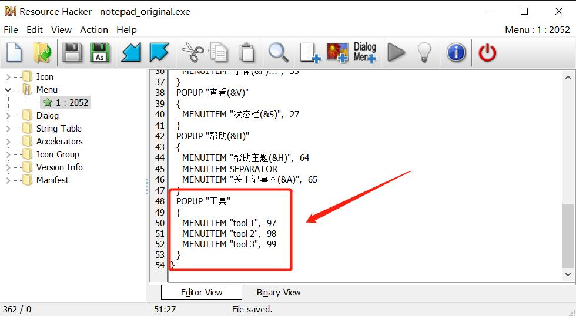
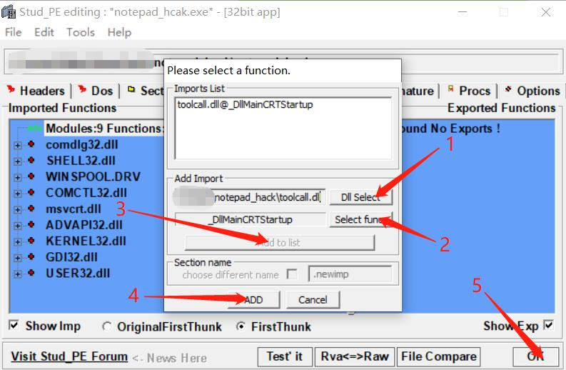
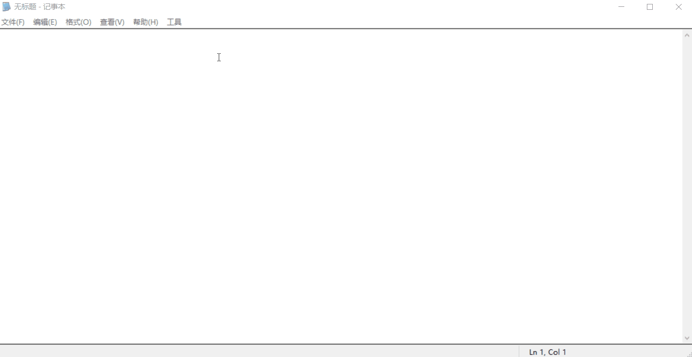

## TL;DR

没什么实际意义，就是玩。教程中代码需要使用nightly版本。

## Step 1

使用 ResourceHacker 给记事本添加一个工具菜单栏，`tool 1`是名字，`97` 是菜单 id。

```
POPUP "工具"
{
   MENUITEM "tool 1",  97
   MENUITEM "tool 2",  98
   MENUITEM "tool 3",  99
}
```



## Step 2

编写一个用来为上面菜单实现功能的[动态链接库](https://zh.wikipedia.org/wiki/%E5%8A%A8%E6%80%81%E9%93%BE%E6%8E%A5%E5%BA%93)，我们需要使用 [windows-sys](https://crates.io/crates/windows-sys)  这个库。

我们使用 `cargo new toolcall --lib` 创建项目，并在 `Cargo.toml` 中指定 `crate-type` 为 `cdylib`。

由于记事本是32位程序，所以我们也要安装32位的rust工具链。

```
rustup target add i686-pc-windows-msvc
```

在 windows 中对于动态链接库，DllMain是入口函数。

程序调用DLL中的导出函数的流程：

- 程序调用Windows API LoadLibrary

- 操作系统寻找LoadLibrary所加载的DLL文件

- 操作系统将DLL文件加载至目标程序进程的内存空间

- 程序自动调用DllMain函数

- 程序调用DLL中导出函数

~~我们创建一个 DllMain 函数~~
由于我们准备使用 `no_std` ，所以我们实际需要创建的是 `_DllMainCRTStartup` 否则你会收到报错
```
...
LINK : error LNK2001: unresolved external symbol __DllMainCRTStartup@12
            Hint on symbols that are defined and could potentially match:
              __DllMainCRTStartup@0
...
```

```rust
#[no_mangle]
pub extern "stdcall" fn _DllMainCRTStartup(
    _h_inst_dll: HINSTANCE,
    call_reason: u32,
    _lpv_reserved: c_void,
) -> BOOL { 1 }
```

它接收三个参数：

- `_h_inst_dll` 是指向DLL本身的实例句柄
- `call_reason` 指明了DLL被调用的原因
- `_lpv_reserved` 保留参数

它返回一个 `BOOL:i32` 我们随便给他一个 `1`

判断 `call_reason` 被调用的原因，它有四种：

- `DLL_PROCESS_ATTACH` 被进程加载
- `DLL_PROCESS_DETACH` 被进程释放
- `DLL_THREAD_ATTACH` 被线程加载
- `DLL_THREAD_DETACH` 被线程释放

这里我们只用到 `DLL_PROCESS_ATTACH` 被进程加载，触发了这个条件之后执行 `SetWindowsHookExW`

```rust
match call_reason {
        DLL_PROCESS_ATTACH => unsafe {
            SetWindowsHookExW(
                WH_GETMESSAGE,
                Some(callback),
                _h_inst_dll,
                GetCurrentThreadId(),
            );
        },
        _ => (),
    }
```

`SetWindowsHookExW` 接受四个参数：

- `idhook` 钩子类型 `WH_GETMESSAGE`
- `lpfn` 调用的函数 `callback`
- `hmod` 实例句柄，我们把当前的句柄传进去 `_h_inst_dll`
- `dwthreadid` 线程id，我们传一个当前线程id `GetCurrentThreadId()`

callback 函数：

```rust
unsafe extern "system" fn callback(n_code: i32, w_param: WPARAM, l_param: LPARAM) -> LRESULT {
    //事件
    ...
    CallNextHookEx(HHOOK::default(), n_code, w_param, l_param)
}
```

参数解释：

- n_code 钩子代码传递给当前的钩子过程值
- w_param 所述的wParam传递给当前挂钩过程值
- l_param 所述的lParam传递给当前挂钩过程值

返回值是 `CallNextHookEx()`，`hhk` 参数被忽略。

事件代码：

```rust
    let msg = &*(l_param as *const MSG);
    if n_code >= 0 {
        if msg.message == WM_COMMAND && msg.wParam == 97 {
            MessageBoxA(
                0,
                transmute(b"hello tool 1\0".as_ptr()),
                transmute(b"title\0".as_ptr()),
                MB_OK,
            );
        }
    }
```

这里我们判断如果 `msg.message` 类型是 `WM_COMMAND`, 并且 `msg.wParam` 的值是 `97`（前面 `tool 1的菜单id`），则弹出一个窗口。

因为我们使用了 `no_std` 所以少不了

```rust
#[lang = "eh_personality"]
#[no_mangle]
pub extern "C" fn rust_eh_personality() {}

#[panic_handler]
#[no_mangle]
pub extern "C" fn panic(_info: &PanicInfo) -> ! {
    loop {}
}
```

编译
```
cargo build --release --target i686-pc-windows-msvc
```

值得一提的是，编译出来的 `toolcall.dll` 只有3kb(3072字节)，好棒。

## Step 3

将 `toolcall.dll` 和记事本放在同一目录下，使用 stud_PE 注入进记事本。

File > Open PE File 再点 Functions 在下面窗口中右键 Add New import



然后打开记事本，效果：



## 结语

关于文件大小其实还有很多优化的空间，不过3kb对我来说已经可以了。

这次我们使用了两款软件 `Resource Hacker` 和 `stud_PE`，下次我们尝试一下使用 `rust` 不借助其它工具不使用 [hook](https://docs.microsoft.com/en-us/windows/win32/winmsg/hooks) 实现我们需要的功能。（鸽

link: https://github.com/kekeimiku/msrs